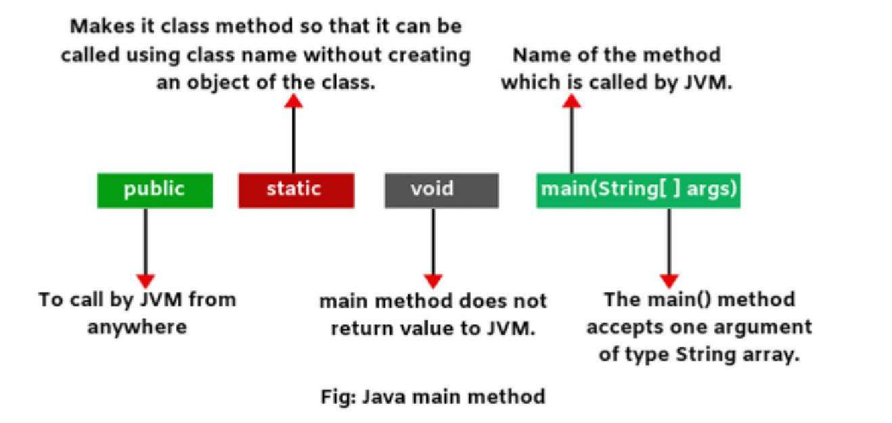

= Java main() Method — Valid Signatures and Edge Cases
:doctype: article

++++
<!-- Bootstrap 5 CSS -->
<link rel="stylesheet" href="https://cdn.jsdelivr.net/npm/bootstrap@5.3.3/dist/css/bootstrap.min.css">

++++

[.section-overview]
== Overview and standard form

[.entrypoint-figure]

_Figure: Conceptual view of the JVM calling the `main` method as the program’s entry point._

• The JVM starts a Java application by invoking a single entry method named `main` on the initial class.
• The **standard signature the JVM looks for** is [important]#`public static void main(String[] args)`#.
• The parameter `args` (or any other name) receives the command‑line arguments as an array of strings.

[.section-typical]
== ✅ Valid / allowed variants of main()

• Modifier order can be swapped; for example, [important]#`static public void main(String[] args)`# is still treated as the same method.

• The `String` array can be written in any of these equivalent forms:
- `public static void main(String[] args)`
- `public static void main(String [] args)`
- `public static void main(String args[])`

• Since Java 5, a var‑args parameter is also valid as the entry point:
`public static void main(String... args) { … }`

• The parameter name itself is irrelevant; this is valid as well:
`public static void main(String[] arguments) { … }`

• Additional modifiers are allowed as long as the core contract is kept; for example:
`public final static void main(String[] args) { … }` or `public static strictfp void main(String... args) { … }`

• Overloaded `main` methods with different parameter lists (for example `public static void main(int[] nums)`) are legal but are **not** used as entry points; they behave like ordinary static methods.

[.section-not-exec]
== ⚠️ Invalid / edge‑case / failure scenarios

If the signature diverges from the required shape, the JVM does not treat the method as an entry point.

[.entrypoint-figure]
====
[.entrypoint-figure-title]#How JVM checks your main method (failure path)#

[.entrypoint-figure-diagram]
1. Look for:  public static void main(String[] args)  or  public static void main(String... args)
2. If not found with that exact name and modifiers → ❌ no valid entry point
3. If found but with wrong return type or parameter type → ❌ ignore as main
4. Only matching signature is executed on startup

[.entrypoint-figure-caption]#If any part of the contract (name, public, static, void, String[] / String...) is broken, the method is not used as the program’s starting point.#
====

. **Missing `static`**
+
code:: `public void main(String[] args)`
+
The JVM cannot call this method without creating an instance, so it reports an error similar to [error-hl]#“main method is not static…”#.

. **Wrong return type**
+
code:: `public static int main(String[] args)`
+
Any non‑`void` return type is rejected as a main entry point; the JVM either says the main method must return `void` or that no suitable main method was found.

. **Wrong parameter type**
+
code:: `public static void main(int[] args)` or `public static void main(Object[] args)`
+
Because the parameter is not `String[]` or `String...`, the signature does not match and the JVM reports that no `public static void main(String[] args)` method exists.

. **Wrong method name**
+
code:: `public static void start(String[] args)`
+
The method name must be exactly [important]#`main`#; otherwise the JVM prints the familiar “main method not found in class …” message.

. **Not `public`**
+
code:: `static void main(String[] args)` or `private static void main(String[] args)`
+
Even with the right name and parameter list, the method must be [important]#`public`#; if it is package‑private, protected or private, the JVM cannot access it and reports that no valid main method exists.

[.section-example]
== Example code with valid and invalid mains

[source,java]
----
public class MainVariants {

    // ✅ Standard, recommended
    public static void main(String[] args) {
        System.out.println("Standard main");
    }

    // ✅ Valid: different parameter name
    public static void main(String[] arguments) {
        System.out.println("Also valid entry point (same signature, different name)");
    }
     // ✅ Valid: with multiple parameter
    // (If this will be present together with any other main method also , it is valid)
    public static void main(String[] args,int args) {
        System.out.println("Multiple params allowed");
    }

    // ✅ Valid: var-args
    public static void main(String... argsVar) {
        System.out.println("Varargs main");
    }

    // ✅ Valid overload (NOT an entry point)
    public static void main(int[] nums) {
        System.out.println("Overloaded main, never called by JVM automatically");
    }

    // ❌ Not an entry point: non-static
    public void main(String[] args) {
        System.out.println("Won't be used as entry point");
    }

    // ❌ Not an entry point: wrong parameter type
    public static void main(int x) {
        System.out.println("Also not used as entry point");
    }
}
----

[.section-summary]
== Key takeaways

• The JVM treats only [important]#`public static void main(String[] args)` or `public static void main(String... args)`# as valid entry signatures.
• Modifier order and parameter name are flexible; return type, parameter type, method name, and `public static` are **not**.
• Overloads of `main` are fine for convenience, but application startup always uses the one method that matches the required entry signature.
